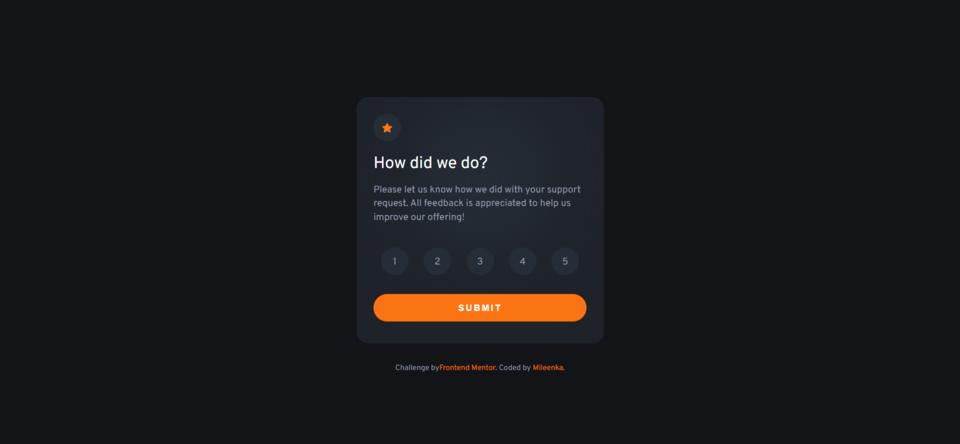
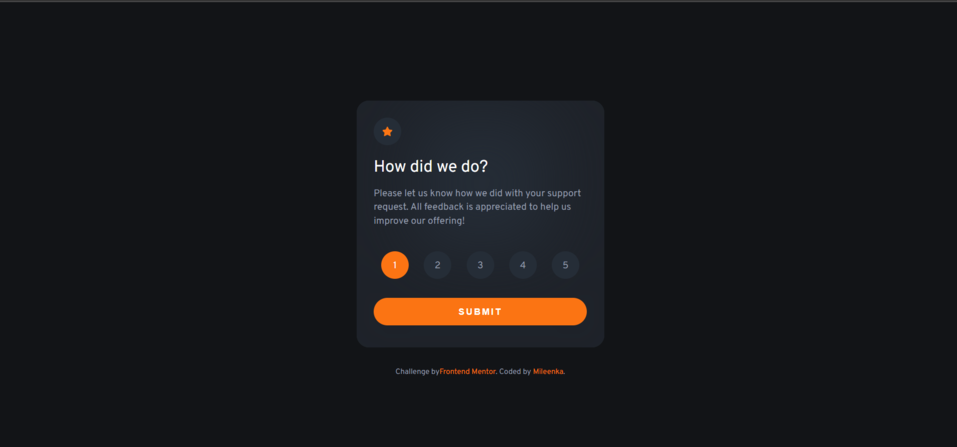
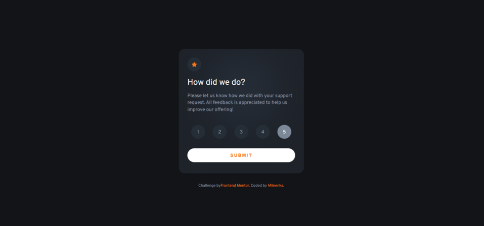
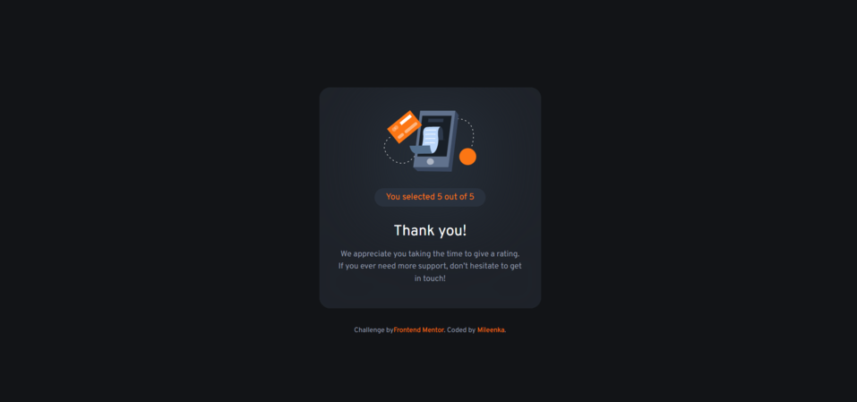

# Frontend Mentor - Interactive rating component solution

This is a solution to the [Interactive rating component challenge on Frontend Mentor](https://www.frontendmentor.io/challenges/interactive-rating-component-koxpeBUmI). Frontend Mentor challenges help me improve my coding skills by building realistic projects. 

## Table of contents

- [Overview](#overview)
  - [The challenge](#the-challenge)
  - [Screenshot](#screenshot)
  - [Links](#links)
- [My process](#my-process)
  - [Built with](#built-with)
  - [Continued development](#continued-development)
- [Author](#author)
- [Acknowledgments](#acknowledgments)

## Overview

### The challenge 💪

- I have optimized the layout of the app depending on the screen size of the device
- I made hover states on all interactive elements on the page
- I have selected and submitted a numerical rating
- I made an interactive "Thank you" card status after submitting a review

### Screenshot 📷

Here are screenshots of my solution 

### Links 🌐

- Solution URL: [Repo](https://github.com/Mileenka/interactive-rating-component)
- Live Site URL: [live](https://mileenka.github.io/interactive-rating-component)

## My process

### Built with 🚀

- Semantic HTML5 markup
- CSS custom properties
- Sass
- Flexbox
- JavaScript

### Continued development

Now I want to focus more on JavaScript 🔥

## Author 👱‍♀️

- GitHub - [Milena](https://github.com/Mileenka)
- Frontend Mentor - [@Mileenka](https://www.frontendmentor.io/profile/Mileenka)
- Slack - [@Mileenka](https://mileenka.slack.com)

## Acknowledgments 📚

I read the documentation.